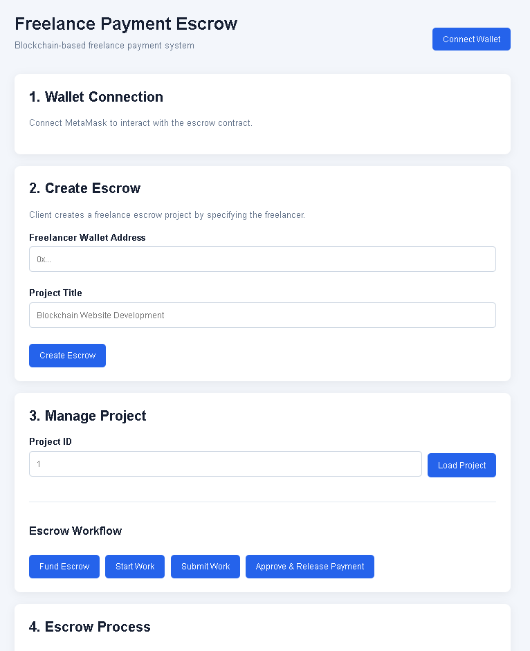
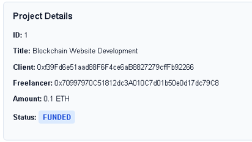
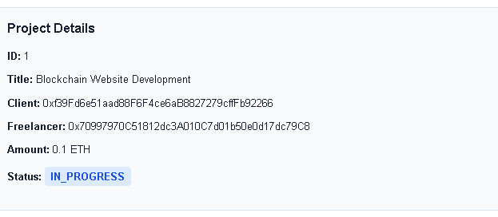
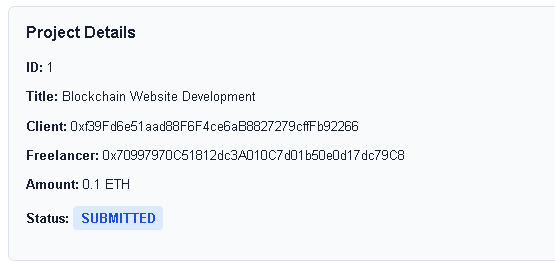
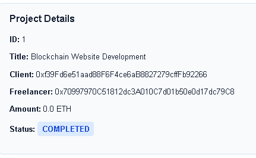

# Freelance Payment Escrow Using Blockchain

  <h1 align="center">Freelance Payment Escrow Using Blockchain</h1>
  

    A blockchain-based escrow application for secure and transparent freelance payments using Solidity smart contracts.
  

---

## 👨‍💻 Developer

**Vayunandan Mishra**  
ECE Student

---

## 📌 Project Overview

**Freelance Payment Escrow Using Blockchain** is a decentralized application designed to provide a secure and transparent payment mechanism between clients and freelancers.

The system uses a **Solidity smart contract** as an escrow mechanism. Instead of directly transferring payment from the client to the freelancer, the payment is held by the smart contract until the freelancer completes the work and the client approves the submission.

The project combines **Blockchain, Solidity, Hardhat, React.js, Ethers.js, and MetaMask** to demonstrate a complete Web3 application workflow.

This project was developed as an **academic and portfolio project** to demonstrate practical skills in blockchain and decentralized application development.

---

## 🎯 Objectives

- Develop a blockchain-based freelance escrow system.
- Securely hold client payments using a smart contract.
- Allow clients to create freelance projects.
- Allow clients to assign freelancers.
- Allow clients to fund escrow projects.
- Allow freelancers to start and submit work.
- Allow clients to approve completed work.
- Automatically release escrow payment through smart contract logic.
- Provide transparent project status tracking.
- Integrate MetaMask for wallet connectivity.
- Build a simple React-based Web3 frontend.
- Test the complete workflow using a Hardhat Local blockchain.

---

## 💡 Problem Statement

Traditional freelance payment systems depend on centralized platforms and intermediaries to manage payments between clients and freelancers.

Some common challenges include:

- Payment delays
- Lack of transparency
- Trust issues between clients and freelancers
- Payment disputes
- Dependency on centralized platforms
- Additional platform or transaction fees

This project demonstrates how blockchain smart contracts can be used to create a transparent escrow workflow where payment is controlled by predefined smart contract rules.

---

## 💡 Proposed Solution

The proposed system introduces a blockchain-based escrow mechanism.

The client creates a project and assigns a freelancer. The agreed payment is deposited into the smart contract. The freelancer then starts and submits the work. After reviewing the submission, the client approves the work and the smart contract releases the payment to the freelancer.

~~~text
Client
   |
   | Create Project
   v
Smart Contract
   |
   | Lock Payment
   v
Freelancer
   |
   | Complete & Submit Work
   v
Client Approval
   |
   | Approve
   v
Smart Contract
   |
   | Release Payment
   v
Freelancer
~~~

---

## ✨ Key Features

- 🔐 MetaMask Wallet Integration
- 👤 Client and Freelancer Wallet Support
- 📝 Create Freelance Escrow Project
- 👨‍💻 Assign Freelancer
- 💰 Fund Escrow
- 🚀 Start Work
- 📤 Submit Work
- ✅ Approve Completed Work
- 💸 Release Escrow Payment
- 🔎 Load Project Details
- 📊 Display Project Status
- 💳 Display Escrow Amount
- 🔗 Blockchain Transaction Interaction
- 🧾 Smart Contract-Based Payment Management
- 🖥️ React Web Interface
- 🧪 Hardhat Local Blockchain Testing

---

## 🛠️ Technology Stack

| Technology | Purpose |
|---|---|
| Solidity | Smart contract development |
| Hardhat | Blockchain development and testing |
| JavaScript | Application and blockchain logic |
| React.js | Frontend development |
| Ethers.js | Blockchain interaction |
| MetaMask | Wallet connectivity |
| Node.js | Development environment |
| HTML5 | Frontend structure |
| CSS3 | Frontend styling |
| Git | Version control |
| GitHub | Source code and documentation |
| Visual Studio Code | Development environment |

---

## 🏗️ System Architecture

~~~text
                    +----------------------+
                    |        Client        |
                    +----------+-----------+
                               |
                               | Wallet
                               v
                    +----------------------+
                    |       MetaMask       |
                    +----------+-----------+
                               |
                               | Web3 Interaction
                               v
                    +----------------------+
                    |    React Frontend    |
                    +----------+-----------+
                               |
                               | Ethers.js
                               v
                    +----------------------+
                    | FreelanceEscrow.sol  |
                    |   Smart Contract     |
                    +----------+-----------+
                               |
                               | Blockchain
                               v
                    +----------------------+
                    |   Hardhat Local      |
                    |     Blockchain       |
                    +----------------------+
                               ^
                               |
                         Wallet Interaction
                               |
                    +----------+-----------+
                    |      Freelancer      |
                    +----------------------+
~~~

---

## 🔄 Complete Escrow Workflow

~~~text
1. Connect Wallet
        ↓
2. Create Escrow
        ↓
3. Assign Freelancer
        ↓
4. Fund Escrow
        ↓
5. Freelancer Starts Work
        ↓
6. Freelancer Submits Work
        ↓
7. Client Reviews Work
        ↓
8. Client Approves Work
        ↓
9. Payment Released
        ↓
10. Project Completed
~~~

---

## 📊 Project Status Flow

~~~text
CREATED
   ↓
FUNDED
   ↓
IN_PROGRESS
   ↓
SUBMITTED
   ↓
COMPLETED
~~~

### CREATED

The client creates a new freelance escrow project and assigns a freelancer.

### FUNDED

The client deposits the agreed payment into the escrow smart contract.

### IN_PROGRESS

The assigned freelancer starts working on the project.

### SUBMITTED

The freelancer submits the completed work for client review.

### COMPLETED

The client approves the submitted work and the smart contract releases the escrow payment.

---

## 🔐 Smart Contract

The primary blockchain logic is implemented in:

~~~text
contracts/FreelanceEscrow.sol
~~~

The smart contract manages:

- Project creation
- Freelancer assignment
- Escrow funding
- Project status
- Work progression
- Work submission
- Client approval
- Payment release
- Project information retrieval
- Contract balance retrieval

### Main Smart Contract Functions

#### createEscrow()

Creates a new freelance project and assigns a freelancer.

#### fundEscrow()

Allows the client to deposit the agreed payment into the escrow contract.

#### startWork()

Allows the assigned freelancer to start the project.

#### submitWork()

Allows the freelancer to submit the completed work.

#### approveAndReleasePayment()

Allows the client to approve submitted work and release the escrow payment.

#### getEscrowDetails()

Retrieves project information from the blockchain.

#### getContractBalance()

Returns the amount currently held by the escrow contract.

---

## 👥 User Roles

### Client

The client can:

1. Connect MetaMask.
2. Create an escrow project.
3. Assign a freelancer wallet.
4. Fund the escrow.
5. View project status.
6. Review submitted work.
7. Approve completed work.
8. Release the escrow payment.

### Freelancer

The freelancer can:

1. Connect the assigned MetaMask wallet.
2. View the assigned project.
3. Start the project.
4. Complete the assigned work.
5. Submit the completed work.
6. Receive payment after client approval.

---

## 🖥️ Frontend

The frontend is developed using **React.js**.

It provides a simple interface for interacting with the blockchain smart contract.

### Frontend Capabilities

- Wallet connection
- Wallet address display
- Escrow creation
- Freelancer address input
- Project title input
- Project ID management
- Project details display
- Escrow funding
- Work status management
- Work submission
- Payment approval
- Payment release
- Contract interaction through MetaMask

---

## 🔗 Web3 Interaction

The React frontend communicates with the smart contract through **Ethers.js** and MetaMask.

~~~text
React Frontend
      ↓
   Ethers.js
      ↓
   MetaMask
      ↓
Hardhat Local Network
      ↓
FreelanceEscrow.sol
~~~

This allows frontend actions to trigger blockchain transactions and read project information from the smart contract.

---

## 🧪 Testing

The project was tested using:

- Hardhat Local Blockchain
- MetaMask
- Solidity Smart Contract
- React.js
- Ethers.js

### Tested Workflow

~~~text
Client Account
      ↓
Create Escrow
      ↓
Fund Escrow
      ↓
Status = FUNDED
      ↓
Freelancer Account
      ↓
Start Work
      ↓
Status = IN_PROGRESS
      ↓
Submit Work
      ↓
Status = SUBMITTED
      ↓
Client Account
      ↓
Approve & Release Payment
      ↓
Status = COMPLETED
~~~

### Test Results

| Test Case | Expected Result | Status |
|---|---|---|
| Connect Wallet | Wallet address displayed | ✅ PASS |
| Create Escrow | Project created | ✅ PASS |
| Fund Escrow | Escrow funded successfully | ✅ PASS |
| Start Work | Status becomes IN_PROGRESS | ✅ PASS |
| Submit Work | Status becomes SUBMITTED | ✅ PASS |
| Approve Payment | Payment released | ✅ PASS |
| Final Verification | Status becomes COMPLETED | ✅ PASS |

---

## 📸 Project Screenshots

The following screenshots demonstrate the working application and escrow workflow.

### 1. Dashboard

**Description:**  
Main application dashboard showing the blockchain escrow interface and project management operations.

---

### 2. Escrow Funded

**Description:**  
Shows the project after the client has funded the escrow smart contract.

**Project Status:**

~~~text
FUNDED
~~~

---

### 3. Work In Progress

**Description:**  
Shows the freelancer starting the assigned project.

**Project Status:**

~~~text
IN_PROGRESS
~~~

---

### 4. Work Submitted

**Description:**  
Shows the freelancer submitting the completed work for client approval.

**Project Status:**

~~~text
SUBMITTED
~~~

---

### 5. Payment Released / Completed

**Description:**  
Shows the client approving the submitted work and releasing the escrow payment.

**Project Status:**

~~~text
COMPLETED
~~~

---

## 📁 Project Structure

~~~text
Freelance-Payment-Escrow-Blockchain/
│
├── contracts/
│   └── FreelanceEscrow.sol
│
├── scripts/
│   └── deploy.js
│
├── test/
│   └── FreelanceEscrow.test.js
│
├── frontend/
│   ├── src/
│   │   ├── App.jsx
│   │   ├── main.jsx
│   │   └── ...
│   ├── package.json
│   └── ...
│
├── docs/
│   ├── Project-Documentation.md
│   └── Testing-and-Results.md
│
├── screenshots/
│   ├── dashboard.png
│   ├── Escrow-Funded.png
│   ├── Work-In-Progress.png
│   ├── Work-Submitted.png
│   └── Payment-Released-Completed.png
│
├── reports/
│   └── report.txt
│
├── hardhat.config.js
├── package.json
├── package-lock.json
├── .gitignore
└── README.md
~~~

---

## ⚙️ Local Installation

### 1. Clone the Repository

~~~bash
git clone https://github.com/Vayu-143/Freelance-Payment-Escrow-Blockchain.git
~~~

### 2. Navigate to the Project

~~~bash
cd Freelance-Payment-Escrow-Blockchain
~~~

### 3. Install Dependencies

~~~bash
npm install
~~~

### 4. Start Hardhat Local Blockchain

~~~bash
npx hardhat node
~~~

Keep this terminal running.

### 5. Compile the Smart Contract

~~~bash
npx hardhat compile
~~~

### 6. Deploy the Smart Contract Locally

~~~bash
npx hardhat run scripts/deploy.js --network localhost
~~~

### 7. Start the Frontend

Open another terminal:

~~~bash
cd frontend
npm install
npm run dev
~~~

The React application will then be available at the local development URL shown in the terminal.

---

## 🦊 MetaMask Configuration

For local blockchain testing, MetaMask can be connected to the Hardhat Local Network.

Typical configuration:

| Setting | Value |
|---|---|
| Network Name | Hardhat Local |
| RPC URL | http://127.0.0.1:8545 |
| Chain ID | 31337 |
| Currency Symbol | ETH |

Hardhat test accounts can be imported into MetaMask for local development and testing.

---

## 🔒 Security Considerations

The project demonstrates several blockchain security concepts:

- Smart contract controlled payment flow
- Wallet-based transaction authorization
- Role-based function access
- State-based project management
- Blockchain transaction records
- Controlled escrow payment release
- Contract-based workflow validation

The project is intended for **educational and portfolio purposes** and should not be considered a production-ready financial escrow service.

---

## 📈 Advantages

- Transparent blockchain-based payment workflow
- Smart contract controlled escrow
- Reduced dependency on centralized intermediaries
- Wallet-based authentication
- Blockchain transaction visibility
- Clear project status management
- Automated contract-based payment release
- Practical Web3 development experience
- Easy local demonstration
- Modular project structure

---

## ⚠️ Limitations

- Currently demonstrated using a Hardhat Local blockchain.
- No production blockchain deployment.
- No advanced dispute-resolution mechanism.
- No decentralized file storage integration.
- No freelancer reputation system.
- No milestone-based payment system.
- No production database.
- Designed as an educational and portfolio prototype.

---

## 🚀 Future Enhancements

Future versions could include:

- Public blockchain testnet deployment
- Production deployment after security auditing
- Milestone-based escrow payments
- IPFS-based work submission
- Freelancer ratings and reviews
- User profile management
- Dispute resolution mechanism
- Transaction history dashboard
- Email or Web3 notifications
- Multi-project management
- Advanced analytics
- DAO-based dispute resolution
- Mobile-responsive Web3 interface
- Smart contract security audit

---

## 🎓 Learning Outcomes

This project provided practical experience in:

- Solidity smart contract development
- Blockchain fundamentals
- Hardhat development
- Smart contract testing
- React.js frontend development
- Ethers.js integration
- MetaMask wallet integration
- Web3 transaction handling
- Blockchain state management
- Git and GitHub project management
- Debugging decentralized applications
- End-to-end Web3 application development

---

## 💼 Portfolio Relevance

This project demonstrates practical skills relevant to:

- Blockchain Developer
- Web3 Developer
- Smart Contract Developer
- Solidity Developer
- Full Stack Developer
- Software Developer
- Web3 Integration Developer

The project demonstrates the ability to build an application that connects a modern frontend with blockchain smart-contract functionality.

---

## 📊 Project Highlights

~~~text
              FREELANCE PAYMENT ESCROW

                    React Frontend
                          │
                          ▼
                       MetaMask
                          │
                          ▼
                       Ethers.js
                          │
                          ▼
                Solidity Smart Contract
                          │
                          ▼
                  Hardhat Blockchain
                          │
                          ▼
                 Escrow Payment Flow
~~~

### Core Workflow

~~~text
CREATE
   ↓
FUND
   ↓
START WORK
   ↓
SUBMIT WORK
   ↓
APPROVE
   ↓
RELEASE PAYMENT
   ↓
COMPLETED
~~~

---

## 🏆 Final Result

The Freelance Payment Escrow system successfully demonstrates a complete blockchain-based freelance payment workflow.

The client can create and fund an escrow project, the assigned freelancer can start and submit the work, and the client can approve the completed work and release the payment through the smart contract.

The project combines **Solidity, Hardhat, React.js, Ethers.js, MetaMask, and blockchain concepts** into a practical Web3 application suitable for academic demonstration and portfolio development.

---

## 👨‍💻 Author

**Vayunandan Mishra**

ECE Student

Interested in:

- Blockchain & Web3
- Software Development
- Embedded Systems
- IoT
- Artificial Intelligence
- Python
- Technology Projects

---

## 🔗 GitHub Repository

**Freelance Payment Escrow Using Blockchain**

https://github.com/Vayu-143/Freelance-Payment-Escrow-Blockchain

---

## ⭐ Support

If you find this project useful for learning blockchain and Web3 development, consider giving the repository a ⭐ on GitHub.

---

## 📜 Disclaimer

This project is developed for **educational, academic, and portfolio purposes**.

It is a prototype demonstrating blockchain-based escrow functionality and is not intended for handling real-world financial transactions or production payment processing without further security auditing, testing, and deployment hardening.